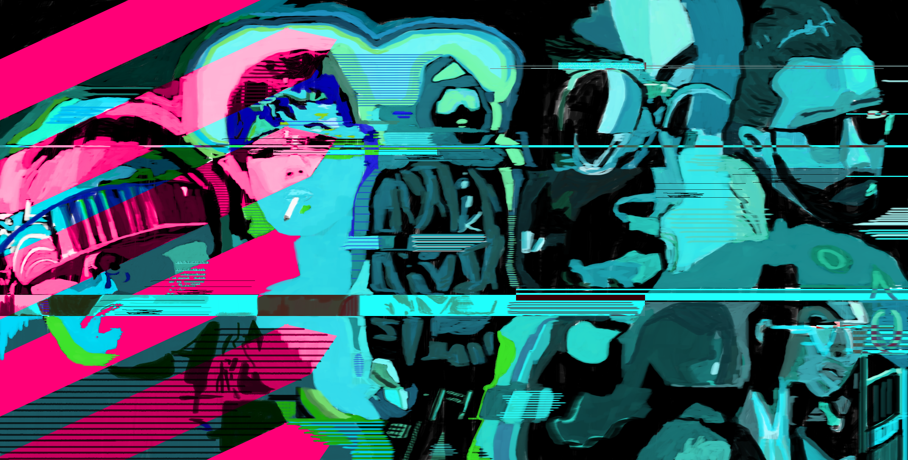

 
<h1 class="index-hero-title">Characters</h1>
 

[▌ Begin: Character Creation ⇒](../Characters/Character_Creation/index.md)

 In **GHOSTBURN**, you are a **Ghost**, someone whose digital identity has been erased. You live outside the system, doing work for your **Medium**, the one who reached out and helped you when your life was in shambles.

You didn't start out as a ghost. You had a life once. A career. A **Background**. But that life went up in smoke when you got **Burned**. The street waits. It knows you, and it waits until you are at your most vulnerable. But before the street could find a use for you, a stranger appeared and offered a deal.

**You took it.** 

The events of your burn still **Haunt** you, but you have work to do. Your medium erased your identity and set you up with a crew. It's a different kind of work than what the corporate knobs do in their glass towers, but it's important. 

Megacorp media labels people like you, *the bad guys*. They call you criminals. Killers. Punks. And they're not totally off the mark, but they miss the nuance of what you're doing, the benefits you bring to society. You make a difference, or, at least, you try. Some people out there have no other options. You exist to fill that void. Invisible and deadly. 

**A Ghost.**